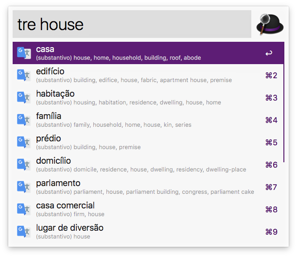
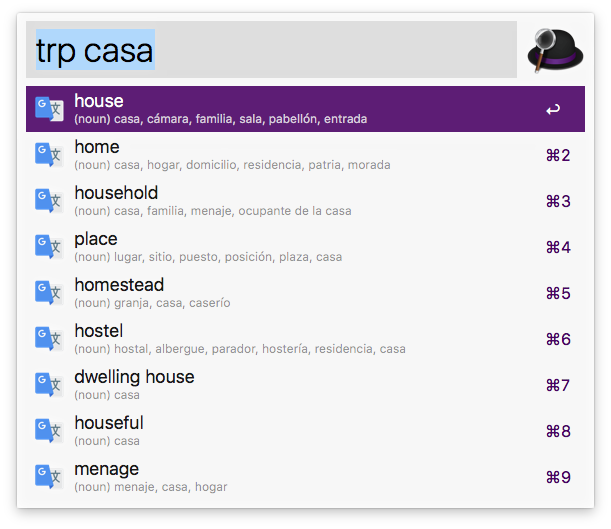

# Google Translate Portuguese/English
Alfred 3 workflow to translate between portuguese and english with google tanslate api

[](https://nodei.co/npm/alfred-google-translate-portuguese/)

## Installation

```
$ npm install -g alfred-google-translate-portuguese
```

*Requires [Node.js](https://nodejs.org) 4+ and the Alfred [Powerpack](https://www.alfredapp.com/powerpack/).*


## usage

In Alfred, enter `tre` or `trp`, and the keyword you want to translate, and query the keyword-related translation results.

`trp` Translate portuguese to english.
`tre` Translate english to portuguese.

Select one of them and press <kbd>enter</kbd> to copy the translation results to the clipboard.

Hold down <kbd>cmd</kbd> and press <kbd>enter</kbd> to pronounce.

If the input keyword is wrong, there will be an error correction prompt. Press <kbd>tab</kbd> to query with the error-corrected keyword.


## Effect
English to Portuguese <kbd>tre</kbd>:


Portuguese to English <kbd>trp</kbd>:


## Related

- [alfy](https://github.com/sindresorhus/alfy) - Create Alfred workflows with ease
- [google-translate-api](https://github.com/matheuss/google-translate-api) - A free and unlimited API for Google Translate


## License

MIT ©